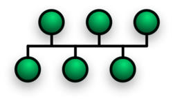

# Apparati di rete

## Hub

Sdoppiatore di porte che lavora a livello fisico.

Connettendo gli hosts alle porte disponibili, si ottiene una semplice connessione a rete bus, con tutte le limitazioni (anche in termini di prestazioni) dettate dalle possibili collisioni.

In una topologia a bus, la connessione è di tipo “half duplex”: basta che due host trasmettano allo stesso momento, per far si che si verifichi una collisione.

Il dominio di collisione corrisponde all’intera rete.

Non possiede alcun tipo di logica interna, tutti i frame ricevuti su una porta, vengono inoltrati a tutte le altre.

<aside>
💡

Nota: L’Hub inoltre i dati su tutte le porte, ma ogni host accetta i pacchetti in arrivo solo se il destination address corrisponde all’indirizzo fisico della propria NIC.

</aside>

## Switch

Evoluzione dell’hub. All’esterno si presenta in modo simile, ma possiede al suo interno una logica di smistamento dei frame, che migliora notevolmente le prestazioni della rete.

Connettendo gli hosts alle porte disponibili, si ottiene una rete a stella, in cui lo switch è il nodo centrale.

Tutti i frame ethernet passano quindi per lo switch, ma la logica interna al dispositivo, veicola il traffico ai soli hosts destinatari.

Durante la trasmissione di un frame in modalità broadcast, lo switch procederà ad inoltrarne una copia su tutte le porte connesse (tranne quella d’ingresso)

Per far si che il traffico dati venga indirizzato solo agli hosts interessati, gli switch mantengono in una memoria interna **volatile CAM** (**Content Addressable Memory**, memorie di tipo associativo indirizzabili in base al contenuto, in cui la ricerca avviene in tempo costante), una tabella **MAC** (anche detta Forwarding Table), in cui viene tenuta traccia dell’associazione tra gli indirizzi MAC degli hosts nella rete, e la porta fisica dello switch ai quali tali hosts sono connessi.

Il processo di funzionamento dello switch, permette di “riempire” e mantenere aggiornate le informazioni contenute all’interno della tabella, in modo trasparente ed automatico:

- Learning - Lo switch riceve un frame ethernet: legge il MAC sorgente, controlla se nella CAM table, esiste già un’entry per tale MAC address. Se non esiste, tiene traccia dell’associazione MAC-Porta d’ingresso dalla quale tale frame è arrivato.
    
    <aside>
    
    
    Se esiste già un’entry per lo stesso MAC, ma associata ad una porta diversa, la entry viene aggiornata. Questo permette la mobilità fisica degli hosts.
    
    </aside>
    
- Forwarding - Lo switch procede ad analizzare il MAC destinazione:
    - Se esiste una entry nella CAM table, viene ricavata la corrispondente porta, ed il frame viene correttamente inoltrato in modalità unicast
    - Altrimenti, il frame viene inondato (flooding) su tutte le porte dello switch, tranne quella di ingresso.
        
        <aside>
        
        
        Inoltrando il traffico in modalità flooding, il destinatario sicuramente riceverà una copia del frame ethernet.
        
        Quando esso risponderà, lo switch provvederà tramite la fase di learning, a tener traccia dell’associazione del MAC del destinatario, pertanto la prossima trasmissione avverrà in modalità unicast.
        
        </aside>
        
- Filtering - Esistono situazioni in cui gli switch decidono di scartare frame definiti inutili o dannosi. Alcuni esempi:
    - Un frame non viene mai rispedito indietro sulla porta da cui è arrivato
    - Se il MAC sorgente e destinazione corrispondono, o sono diversi ma si trovano sulla stessa porta, il frame viene scartato.

<aside>

Tra queste funzioni, gli switch incorporano anche un meccanismo di “aging”, per evitare che la tabella si riempia con informazioni obsolete.

Ogni entry appresa dinamicamente, è associata ad un timer (generalmente di 300 secondi): quando un frame associato a tale MAC (sorgente o destinazione) entra nello switch, il timer viene rinnovato.

Allo scadere, l’entry viene rimossa.

</aside>

<aside>

Generalmente, gli switch sono catalogati come apparati di rete di livello 2, anche se ne esistono versioni in grado di lavorare anche a livello 3.

</aside>

## Bridge

Dispositivo di livello 2, che permette di collegare due segmenti di rete diversi, facendo in modo che appaiano come una rete unica.

<aside>

Gli switch collegano i singoli host, i bridge collegano segmenti di rete.

</aside>

Può essere utilizzato anche per interconnettere reti che operano su tecnologie diverse: per esempio, i router casalinghi, integrano anche la funzionalità di bridge, per far si che dispositivi collegati in Wi-Fi e altri collegati via cavo, possano comunicare trasparentemente.
